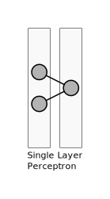
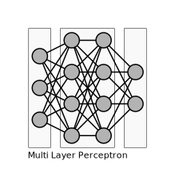
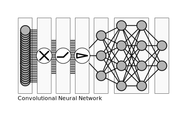
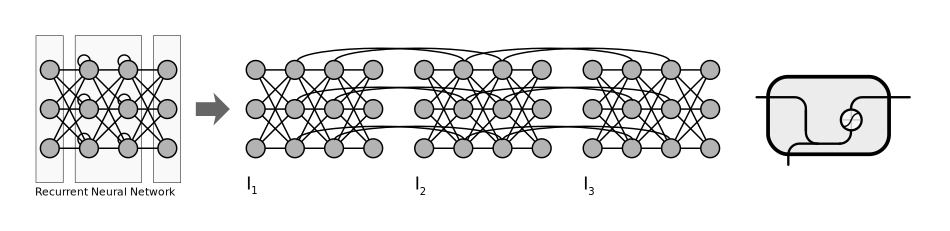
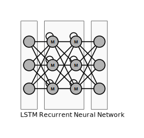
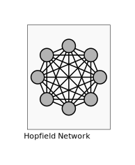
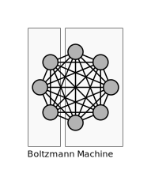

# Artificial Intelligence Demo

Demo Code with Examples for educational purpose

## Classification

- Weak AI
  - Focuses on a specific field of application
- Strong AI
  - Generalized

## Frameworks

Caffe2
- Facebook
CNTK (Cognitive Tool Kit)
- Microsoft
Leaf
MxNet
- Amazon
Pytorch
- Language Bindings
  - Python
- Features
  - Dynamic Computation Graphs (by run)
    - Grpah is defined on the fly
    - Better for unstructured data
TensorFlow
- Google
Theano
- Université de Montréal
Torch
- Language Bindings
  - Lua

Abstraction Framework
- Keras

Ressources:
- [Keras Tutorial TensorFlow | Deep Learning with Keras | Building Models with Keras | Edureka](https://www.youtube.com/watch?v=Y1-hQdgftMQ)

## Interchange Formats for Models

- ONNX

## Machine Learning

Resources:
- [Machine learning](https://en.wikipedia.org/wiki/Machine_learning)
- [What Is The Difference Between Artificial Intelligence And Machine Learning?](https://www.forbes.com/sites/bernardmarr/2016/12/06/what-is-the-difference-between-artificial-intelligence-and-machine-learning/)
### Types

#### Supervised Learning

#### Semi-Supervised Learning

#### Unsupervised Learning

#### Reinforcement Learning

### Problems

#### Regression

Estimating the relationships among variables

#### Classification

Output represents the probability that a class can be assocaited with the input

Resources:
- [Machine Learning anhand von drei Algorithmen erklärt](https://www.golem.de/news/random-forest-k-means-genetik-machine-learning-anhand-von-drei-algorithmen-erklaert-1810-136755.html)
- [Was Regressionen leisten können](https://www.golem.de/news/kuenstliche-intelligenz-wie-computer-lernen-1810-135633-2.html)

## Random Forests

## k-Means

## Neural Networks

### Single Layer Perceptron

### Radial Basis Network (RBN)

!radial basis network diagram

### Multi Layer Perceptron

### Convolutional Neural Network (CNN)

Reduces complexity of fully connected NN's caused by
high number of input parameters.

Specialized layers:
- Convolutional Layer
  - Applies convolution 
- ReLU Layer
  - Applies activation function to each pixel
- Pooling Layer
  - Shrinking the input
  - Usually a filter based on a window
    - Usually the filter is max
- Fully-Connected Layer
  - Regular NN

Resources:
- [Convolutional Neural Network](https://de.wikipedia.org/wiki/Convolutional_Neural_Network)
- [Convolutional Neural Network (CNN) | Convolutional Neural Networks With TensorFlow | Edureka](https://www.youtube.com/watch?v=umGJ30-15_A)

### Recurrent Neural Network

### Long Short-Term Memory (LSTM) Recurrent Neural Network

### Hopfield Network

### Boltzmann Machine

## Challenges and Design Decisions

Generalization Problem:

Quality                  |Acc. Training Data|Acc. Test Data
-------------------------|-----------------:|-------------:
High Bias                |65%               |62%
Just Right               |90%               |87%
High Variance/Overfitting|100%              |20%

- How many hidden layers
  - Example motivation: in the context of image recognition the first layer might detect edges, the second higher level patterns like loops
- How many nodes in a layer
- Overfitting
  - "Settling on a bad, overly complex theory gerrymandered to fit all the past training data is known as overfitting"
  - The model has "memorized" the training dataset to well
  - How to avoid
    - Increase amount of Training Data
      - Possibility: Data Augmentation
        - Generated data based on existing data
          - Mirroring images
          - Zoom into images
          - Distorting images
        -Training on too neat data might result in a bad model
    - [Regularization](#regularization)
- Batch normalization of input to speed up learning
- How to solve the binding problem
  - Segmentation

Resources:
- [Fedora Linux, Chrome OS, KI-Fails | c't uplink 24.8](https://youtu.be/1ESqpc2jPiU?t=3830)
- [Binding problem](https://en.wikipedia.org/wiki/Binding_problem)

## Terms

Resources:
- [Machine Learning Glossary](https://developers.google.com/machine-learning/glossary/)

### Activation

- A function that is applied to the input values before summing up
- Examples
  - sigmoid
    - Formula: sigmoid(x)=1/(1+e^-x)
    - Useful for squishing values in to the interval of -1 to 1
  - Rectified Linear Unit (ReLU)
    - Formula: ReLU(x)=max(x,0)
    - Replaced sigmoid in practice because it is a faster learner

### Bias

- A summand that may be included in an activation function to raise or lowers the threshold for a meaningful activation

### Cost function (loss function)

- Determines how good the actual output is in comparison to the optimal output
- Examples
  - Mean squared error
  - Mean absolute error
  - Mean absolute percentage error
  - Mean squared logarithmic error
  - Squared hinge
  - Hinge
  - Categorical hinge
  - Logarithm of the hyperbolic cosine of the error
    - log(cosh(x))
  - categorical crossentropy
  - Sparse categorical crossentropy
  - Binary crossentropy
  - Kullback-Leibler divergence
  - Poisson
  - Cosine proximity
- Result is called the cost of a single training
- Needs to be optimized
  - See gradient descent

### Gradient Descent

- Optimization approach, finding a (local) minima
- Variants
  - Batch gradient descent
  - Stochastic gradient descent
    - Not averaging over the entire training data
    - Instead using mini batches of training data
  - Mini-batch gradient descent
- Algorithms
  - Stochastic gradient descent (SGD)
  - RMSprop
  - Adagrad
  - Adadelta
  - Adam
  - Adamax
  - Nadam
- Challenges
  - Choosing proper learning rate
  - Not getting trapped in a suboptimal local minima

Resources:
- [An overview of gradient descent optimization algorithms](http://ruder.io/optimizing-gradient-descent/)

### Backpropagation

- Efficient calculation of the gradient at the sampleof the cost function
- Gives a hint how "steep the slope is"
- Determines the direction of an adjustment

### Normalization

- For example scaling
- Speeds up learning

### Regularization

Penalizing to complex in order to mitigate the risk of overfitting
- cost(x) = loss(x) + regularization term

- Algorithms
  - l1
    - Based on sum of absolute weights
    - Motivation
      - Model complexity and high weights are correlated
  - l2
    - Based on squared sum of absolute weights
  - Dropout
    - Randomly deactivate nodes
- Related Algorithms
  - Early Stop
    - Stop training when accuracy of test data does not improve

Resources:
- [An Overview of Regularization Techniques in Deep Learning (with Python code)](https://www.analyticsvidhya.com/blog/2018/04/fundamentals-deep-learning-regularization-techniques/)

## Sample Data

- MNIST Database
  - Handwritten numbers

Resources:
- [Neural Networks and Deep Learning](http://neuralnetworksanddeeplearning.com/)
- [Deep Learning](http://www.deeplearningbook.org/)
- [Neural Networks, Manifolds, and Topology](http://colah.github.io/posts/2014-03-NN-Manifolds-Topology/)
- [Neural Networks - 3Blue1Brown Series](https://www.youtube.com/playlist?&list=PLZHQObOWTQDNU6R1_67000Dx_ZCJB-3pi)
- [Netzgespinste - Die Mathematik neuronaler Netze: einfache Mechanismen, komplexe Konstruktion](https://www.heise.de/select/ct/2016/06/1458191210995647)
- [Machine Learning Recipes with Josh Gordon](https://www.youtube.com/playlist?list=PLOU2XLYxmsIIuiBfYad6rFYQU_jL2ryal)
- [Fedora Linux, Chrome OS, KI-Fails | c't uplink 24.8](https://youtu.be/1ESqpc2jPiU?t=3398)
- [A Neural Network Playground](https://playground.tensorflow.org/)
- [ConvnetJS demo: toy 2d classification with 2-layer neural network](https://cs.stanford.edu/people/karpathy/convnetjs/demo/classify2d.html)

## Jupyter Notebook

### Tutorials

- [A gallery of interesting Jupyter Notebooks](https://github.com/jupyter/jupyter/wiki/A-gallery-of-interesting-Jupyter-Notebooks)
- [Deep Learning with Python, TensorFlow, and Keras tutorial](https://www.youtube.com/watch?v=wQ8BIBpya2k)

### Troubleshooting

- [Notebook gives blank page when start ](https://github.com/jupyter/notebook/issues/4467#issuecomment-471867371)