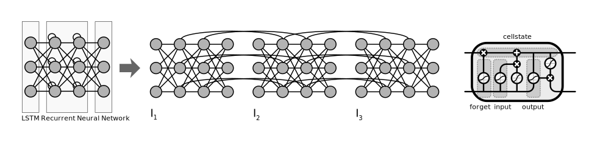

# Artificial Intelligence Demo

Demo Code with Examples for educational purpose

## Fields

### Artificial Intelligence

#### Differentiation

##### Weak AI

Focuses on a specific field of application

##### Strong/Generalized AI

Has the ability to adapt to new situations

Resources

- [Comparing humans with the best Reinforcement Learning algorithms](https://www.youtube.com/watch?v=Ol0-c9OE3VQ)

### Machine Learning

A subfield of [Artificial Inteligence](#artificial-inteligence)

Resources:

- [Machine learning](https://en.wikipedia.org/wiki/Machine_learning)
- [What Is The Difference Between Artificial Intelligence And Machine Learning?](https://www.forbes.com/sites/bernardmarr/2016/12/06/what-is-the-difference-between-artificial-intelligence-and-machine-learning/)
- [Machine Learning Glossary](https://developers.google.com/machine-learning/glossary/)

#### Differentiation

##### Supervised Learning

Preconditions

- A sufficiently large amount of data with a sufficient quality is available
- All data is labeled e.g. the desired outcome is associated with each sample

##### Semi-Supervised Learning

Preconditions

- A sufficiently large amount of data with a sufficient quality is available
- Some of the data is labeled

##### Unsupervised Learning

Preconditions

- A sufficiently large amount of data with a sufficient quality is available
- None of the data is labeled

##### Reinforcement Learning

Preconditions

- Building upon data is not sufficient for solving the problem
- Modeled as Markov decision process thus optimizing a *sparse* and *time-delayed reward* is required

Challenges

- Explore-Exploit Dilemma
- Credit Assignment Problem
  - When to provide a reward? Not every frame but more than once (sparse labels)
  - Solution: Reward Shaping
    - Downsides:
      - Human interaction required
      - Alignment Problem (overfitting)
      - May constrain a policy to the behaviour of humans, which might be undesired
      - Bound to context

Resources

- [An introduction to Reinforcement Learning](https://www.youtube.com/watch?v=JgvyzIkgxF0)
- [Overcoming sparse rewards in Deep RL: Curiosity, hindsight & auxiliary tasks](https://www.youtube.com/watch?v=0Ey02HT_1Ho)
- [Introduction to Reinforcement Learning — Chapter 1](https://towardsdatascience.com/introduction-to-reinforcement-learning-chapter-1-fc8a196a09e8)
- [Guest Post (Part I): Demystifying Deep Reinforcement Learning](https://www.intel.ai/demystifying-deep-reinforcement-learning/)

## Problems

- [Choosing the right estimator](https://scikit-learn.org/stable/tutorial/machine_learning_map/index.html)

### Regression

> Predicting a continuous-valued attribute associated with an object
([source](https://scikit-learn.org/stable/index.html))

Estimating the relationships among variables

### Classification

> Identifying to which category an object belongs to
([source](https://scikit-learn.org/stable/index.html))

Output represents the probability that a class can be assocaited with the input

Resources

- [Classifier comparison](https://scikit-learn.org/stable/auto_examples/classification/plot_classifier_comparison.html)
- [Machine Learning anhand von drei Algorithmen erklärt](https://www.golem.de/news/random-forest-k-means-genetik-machine-learning-anhand-von-drei-algorithmen-erklaert-1810-136755.html)
- [Was Regressionen leisten können](https://www.golem.de/news/kuenstliche-intelligenz-wie-computer-lernen-1810-135633-2.html)

### Clustering

> Automatic grouping of similar objects into sets
([source](https://scikit-learn.org/stable/index.html))

### Dimensionality reduction

> Reducing the number of random variables to consider
([source](https://scikit-learn.org/stable/index.html))

## Machine Learning Algorithms

Overview

### Regression Algorithms

- Ordinary Least Squares Regression (OLSR)
- Linear Regression
- Logistic Regression
- Stepwise Regression
- Multivariate Adaptive Regression Splines (MARS)
- Locally Estimated Scatterplot Smoothing (LOESS)

### Instance-based Algorithms

- k-Nearest Neighbor (kNN)
- Learning Vector Quantization (LVQ)
- Self-Organizing Map (SOM)
- Locally Weighted Learning (LWL)

### Regularization Algorithms

- Ridge Regression
- Least Absolute Shrinkage and Selection Operator (LASSO)
- Elastic Net
- Least-Angle Regression (LARS)

### Decision Tree Algorithms

- Classification and Regression Tree (CART)
- Iterative Dichotomiser 3 (ID3)
- C4.5 and C5.0 (different versions of a powerful approach)
- Chi-squared Automatic Interaction Detection (CHAID)
- Decision Stump
- M5
- Conditional Decision Trees

### Bayesian Algorithms

- Naive Bayes
- Gaussian Naive Bayes
- Multinomial Naive Bayes
- Averaged One-Dependence Estimators (AODE)
- Bayesian Belief Network (BBN)
- Bayesian Network (BN)

### Clustering Algorithms

- k-Means
- k-Medians
- Expectation Maximisation (EM)
- Hierarchical Clustering

### Association Rule Learning Algorithms

- Apriori algorithm
- Eclat algorithm

### Artificial Neural Network Algorithms

- Perceptron
- Back-Propagation
- Hopfield Network
- Radial Basis Function Network (RBFN)

#### Components

##### Activation

- A function that is applied to the input values before summing up
- Examples
  - sigmoid
    - Formula: sigmoid(x)=1/(1+e^-x)
    - Useful for squishing values in to the interval of -1 to 1
  - Rectified Linear Unit (ReLU)
    - Formula: ReLU(x)=max(x,0)
    - Replaced sigmoid in practice because it is a faster learner

##### Bias

- A summand that may be included in an activation function to raise or lowers the threshold for a meaningful activation

##### Cost function (loss function)

- Determines how good the actual output is in comparison to the optimal output
- Examples
  - Mean squared error
  - Mean absolute error
  - Mean absolute percentage error
  - Mean squared logarithmic error
  - Squared hinge
  - Hinge
  - Categorical hinge
  - Logarithm of the hyperbolic cosine of the error
    - log(cosh(x))
  - categorical crossentropy
  - Sparse categorical crossentropy
  - Binary crossentropy
  - Kullback-Leibler divergence
  - Poisson
  - Cosine proximity
- Result is called the cost of a single training
- Needs to be optimized
  - See gradient descent

##### Optimizier

Gradient Descent

- Optimization approach, finding a (local) minima
- Variants
  - Batch gradient descent
  - Stochastic gradient descent
    - Not averaging over the entire training data
    - Instead using mini batches of training data
  - Mini-batch gradient descent
- Algorithms
  - Stochastic gradient descent (SGD)
  - RMSprop
  - Adagrad
  - Adadelta
  - Adam
  - Adamax
  - Nadam
- Challenges
  - Choosing proper learning rate
  - Not getting trapped in a suboptimal local minima

Resources:
- [An overview of gradient descent optimization algorithms](http://ruder.io/optimizing-gradient-descent/)

##### Loss-Function

Backpropagation

- Efficient calculation of the gradient at the sampleof the cost function
- Gives a hint how "steep the slope is"
- Determines the direction of an adjustment

#### Variants

Resources

- [The mostly complete chart of Neural Networks, explained](https://towardsdatascience.com/the-mostly-complete-chart-of-neural-networks-explained-3fb6f2367464)

##### Single Layer Perceptron

##### Radial Basis Network (RBN)

##### Multi Layer Perceptron

##### Residual Neural Network (ResNet)

##### Convolutional Neural Network (CNN)

Reduces complexity of fully connected NN's caused by
high number of input parameters.

Specialized layers:
- Convolutional Layer
  - Applies convolution 
- ReLU Layer
  - Applies activation function to each pixel
- Pooling Layer
  - Shrinking the input
  - Usually a filter based on a window
    - Usually the filter is max
- Fully-Connected Layer
  - Regular NN

Resources:

- [Convolutional Neural Network](https://de.wikipedia.org/wiki/Convolutional_Neural_Network)
- [Convolutional Neural Network (CNN) | Convolutional Neural Networks With TensorFlow | Edureka](https://www.youtube.com/watch?v=umGJ30-15_A)
- [Visualizing Various Filter Initializers in Keras](https://blog.goodaudience.com/visualizing-various-filter-initializers-in-keras-ca14c996db22)
- [Keras Conv2D and Convolutional Layers](https://www.pyimagesearch.com/2018/12/31/keras-conv2d-and-convolutional-layers/)

##### Recurrent Neural Network (RNN)

Background

- Used with sequential data

##### Long Short-Term Memory (LSTM)

Background

- Tackles the problem that RNN's are not optimal for long sequences

Resources

- [Understanding LSTM Networks](http://colah.github.io/posts/2015-08-Understanding-LSTMs/)

##### Deep Q Network (DQN)

- [Deep Q-Learning with Keras and Gym](https://keon.io/deep-q-learning/)

##### Hopfield Network

##### Boltzmann Machine

### Deep Learning Algorithms

- Deep Boltzmann Machine (DBM)
- Deep Belief Networks (DBN)
- Convolutional Neural Network (CNN)
- Stacked Auto-Encoders

### Dimensionality Reduction Algorithms

- Principal Component Analysis (PCA)
- Principal Component Regression (PCR)
- Partial Least Squares Regression (PLSR)
- Sammon Mapping
- Multidimensional Scaling (MDS)
- Projection Pursuit
- Linear Discriminant Analysis (LDA)
- Mixture Discriminant Analysis (MDA)
- Quadratic Discriminant Analysis (QDA)
- Flexible Discriminant Analysis (FDA)

### Ensemble Algorithms

- Boosting
- Bootstrapped Aggregation (Bagging)
- AdaBoost
- Stacked Generalization (blending)
- Gradient Boosting Machines (GBM)
- Gradient Boosted Regression Trees (GBRT)
- Random Forest

Resources

- [A Tour of Machine Learning Algorithms](https://machinelearningmastery.com/a-tour-of-machine-learning-algorithms/)
- [Types of Machine Learning Algorithms You Should Know](https://towardsdatascience.com/types-of-machine-learning-algorithms-you-should-know-953a08248861)

## Process

- [The 7 Steps of Machine Learning](https://towardsdatascience.com/the-7-steps-of-machine-learning-2877d7e5548e)

### 1) Gathering Data

- MNIST Database
  - Handwritten numbers
- ImageNet
- Iris

Resources

- [The Best 25 Datasets for Natural Language Processing](https://gengo.ai/datasets/the-best-25-datasets-for-natural-language-processing/)

Resources:
- [Neural Networks and Deep Learning](http://neuralnetworksanddeeplearning.com/)
- [Deep Learning](http://www.deeplearningbook.org/)
- [Neural Networks, Manifolds, and Topology](http://colah.github.io/posts/2014-03-NN-Manifolds-Topology/)
- [Neural Networks - 3Blue1Brown Series](https://www.youtube.com/playlist?&list=PLZHQObOWTQDNU6R1_67000Dx_ZCJB-3pi)
- [Netzgespinste - Die Mathematik neuronaler Netze: einfache Mechanismen, komplexe Konstruktion](https://www.heise.de/select/ct/2016/06/1458191210995647)
- [Machine Learning Recipes with Josh Gordon](https://www.youtube.com/playlist?list=PLOU2XLYxmsIIuiBfYad6rFYQU_jL2ryal)
- [Fedora Linux, Chrome OS, KI-Fails | c't uplink 24.8](https://youtu.be/1ESqpc2jPiU?t=3398)
- [A Neural Network Playground](https://playground.tensorflow.org/)
- [ConvnetJS demo: toy 2d classification with 2-layer neural network](https://cs.stanford.edu/people/karpathy/convnetjs/demo/classify2d.html)

#### Data Formats 

- [HDF5](https://www.hdfgroup.org/)

### 2) Preparing Data

#### Normalization/Standardization

Scaling input data affects the shaüe of the loss-function.
Ensuring values in a range e.g. from 0 to 1 will be beneficial for the optimization
of the loss-function if the model is initialized with random values in this range.

In case the distribution of the input data is unkown, or known to differ from a Gaussian distribution,
normalization might be the best option.

In case the distribution of the input data is known to be a Gaussian distribution,
standardization (a mean of zero and a standard deviation of one) ought to be applied.

Resources

- [How to Improve Neural Network Stability and Modeling Performance With Data Scaling](https://machinelearningmastery.com/how-to-improve-neural-network-stability-and-modeling-performance-with-data-scaling/)
- [Standardize or Normalize? — Examples in Python](https://medium.com/@rrfd/standardize-or-normalize-examples-in-python-e3f174b65dfc)
- [How to Accelerate Learning of Deep Neural Networks With Batch Normalization](https://machinelearningmastery.com/how-to-accelerate-learning-of-deep-neural-networks-with-batch-normalization/)
- [How To Prepare Your Data For Machine Learning in Python with Scikit-Learn](https://machinelearningmastery.com/prepare-data-machine-learning-python-scikit-learn/)
- [Differences between L1 and L2 as Loss Function and Regularization](http://www.chioka.in/differences-between-l1-and-l2-as-loss-function-and-regularization/)
  - [Distinction: Stability vs. Resiliency – not the same thing](https://prebenormen.com/progress-success-failure/distinction-stability-vs-resiliency-not-the-same-thing)

#### Centering (Images)

- [Normalization and centering of images in MNIST](https://www.kaggle.com/c/digit-recognizer/discussion/6366)

#### Data Augmentation

- [Data Augmentation | How to use Deep Learning when you have Limited Data — Part 2](https://medium.com/nanonets/how-to-use-deep-learning-when-you-have-limited-data-part-2-data-augmentation-c26971dc8ced)

#### One-Hot Encoding

- [What is One Hot Encoding? Why And When do you have to use it?](https://hackernoon.com/what-is-one-hot-encoding-why-and-when-do-you-have-to-use-it-e3c6186d008f)

### 3) Choosing a Model

### 4) Training

### 5) Evaluation

### 6) Hyper-Parameter Optimization

Options:
- Manual Search
- Grid Search
- Random Search
- Bayesian Optimization

Resources

- [Hyper-Parameter Optimization](https://github.com/Hvass-Labs/TensorFlow-Tutorials/blob/master/19_Hyper-Parameters.ipynb)
- [Hyperparameter Optimization - The Math of Intelligence #7](https://www.youtube.com/watch?v=ttE0F7fghfk)

#### Challenges

Generalization Problem:

Quality                  |Acc. Training Data|Acc. Test Data
-------------------------|-----------------:|-------------:
High Bias                |65%               |62%
Just Right               |90%               |87%
High Variance/Overfitting|100%              |20%

- How many hidden layers
  - Example motivation: in the context of image recognition the first layer might detect edges, the second higher level patterns like loops
- How many nodes in a layer
- Overfitting
  - "Settling on a bad, overly complex theory gerrymandered to fit all the past training data is known as overfitting"
  - The model has "memorized" the training dataset to well
  - How to avoid
    - Increase amount of Training Data
      - Possibility: Data Augmentation
        - Generated data based on existing data
          - Mirroring images
          - Zoom into images
          - Distorting images
        -Training on too neat data might result in a bad model
    - [Regularization](#regularization)
- Batch normalization of input to speed up learning
- How to solve the binding problem
  - Segmentation

Resources:
- [Fedora Linux, Chrome OS, KI-Fails | c't uplink 24.8](https://youtu.be/1ESqpc2jPiU?t=3830)
- [Binding problem](https://en.wikipedia.org/wiki/Binding_problem)

#### Hyperparameter Tuning

#### Regularization

Penalizing to complex in order to mitigate the risk of overfitting
- cost(x) = loss(x) + regularization term

- Norms
  - l1
    - Based on sum of absolute weights
    - Motivation
      - Model complexity and high weights are correlated
  - l2
    - Based on squared sum of absolute weights
  - Dropout
    - Randomly deactivate nodes

Resources

- [An Overview of Regularization Techniques in Deep Learning (with Python code)](https://www.analyticsvidhya.com/blog/2018/04/fundamentals-deep-learning-regularization-techniques/)

#### Early Stopping

Stop training when accuracy of test data does not

Resources

- [Neural Network Early Stopping](https://chrisalbon.com/deep_learning/keras/neural_network_early_stopping/)

### 7) Prediction

Resources

- [How to Make Predictions with Keras](https://machinelearningmastery.com/how-to-make-classification-and-regression-predictions-for-deep-learning-models-in-keras/)

## Visualization

- 'How neural networks learn' Series
  - [Part I: Feature Visualization](https://www.youtube.com/watch?v=McgxRxi2Jqo)
  - [Part II: Adversarial Examples](https://www.youtube.com/watch?v=4rFOkpI0Lcg)
  - [Part III: The learning dynamics behind generalization and overfitting](https://www.youtube.com/watch?v=pFWiauHOFpY)

## Tools

### Jupyter Notebook

#### Resources

- [A gallery of interesting Jupyter Notebooks](https://github.com/jupyter/jupyter/wiki/A-gallery-of-interesting-Jupyter-Notebooks)
- [Deep Learning basics with Python, TensorFlow and Keras](https://www.youtube.com/playlist?list=PLQVvvaa0QuDfhTox0AjmQ6tvTgMBZBEXN)
- [Jupyter Notebook Cheat Sheets](https://ugoproto.github.io/ugo_py_doc/JN_CS/)

#### Troubleshooting

- [Notebook gives blank page when start](https://github.com/jupyter/notebook/issues/4467#issuecomment-471867371)
- [Fehlermeldung "<tensor> is not an element of this graph." when loading model](https://github.com/keras-team/keras/issues/6462)
  - Assure the model is used in the same thread where it has been loaded

## Social Impact

### Reproducibility Crisis

- [Wirbel um Reproduzierbarkeitskrise durch KI](https://www.heise.de/newsticker/meldung/Wirbel-um-Reproduzierbarkeitskrise-durch-KI-4326803.html)

### Ethics and Accountability

- [Automation, Ethics And Accountability Of AI Systems](https://www.forbes.com/sites/adigaskell/2018/04/18/automation-ethics-and-accountability-of-ai-systems/)

## Tutorials

- [TensorFlow-Tutorials - Hvass-Labs](https://github.com/Hvass-Labs/TensorFlow-Tutorials)

## Frameworks

Recommendtations accoding to [Deep Learning Frameworks 2019](https://www.youtube.com/watch?v=SJldOOs4vB8):

- Keras
  - For Beginners
- Pytorch or Sonnet
  - For Research
- Tensorflow
  - For production on GCP
- MXNET
  - For production on AWS
- CNTK
  - For production on Azure
- DL4J
  - For Java developers
- CoreML
  - For iOS developers
- ONNX
  - For interoperability

## Examples

- [AI Experiments](https://experiments.withgoogle.com/collection/ai)
- [Semantic Image Synthesis with Spatially-Adaptive Normalization (SPADE)](https://nvlabs.github.io/SPADE/)
